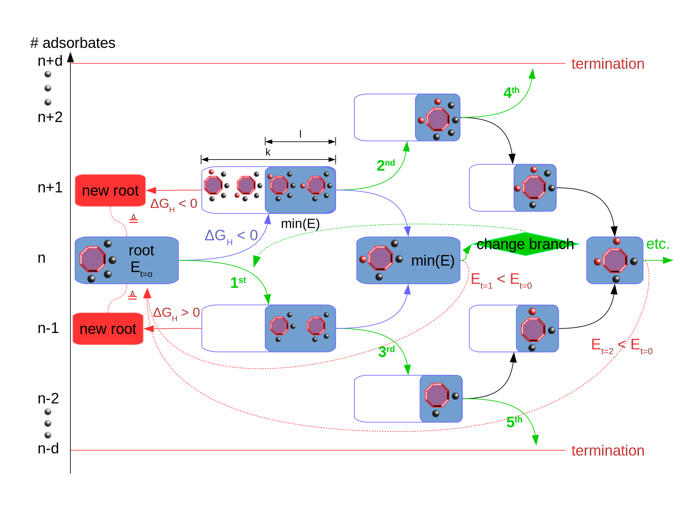

Coverage Ladder Workflow
========================

The coverage ladder workflow usually uses a structure provided by simple coverage as input (simulation document taken from the mongodb database).
If another input is desired, it requires care in generating the simulations document. It has to correctly categorize which atoms belong to the nanocluster and which ones are adsorbates. Furthermore, it needs to point to a document containing the nanocluster's total energy.

So far, only atomic adsorbates are supported.

The coverage ladder is a more sophisticated heuristic/machine-learning workflow which consistently improves the coverage iteratively. The logic of the workflow is sketched below:

The target coverage is where the adsorption free energy is around zero. Since computing the free energy is costly, it is approximated by a constant shift. The parameter **free_energy_correction** needs to be estimated by the user (e.g. separate DFT calculations, literature).

The workflow adds or removes adsorbates one by one trying different candidates or locations simultaneously. The type of adsorbate atom is defined by **adsorbate_name**.

The decision to go up or down the coverage ladder depends on the following property (given an adsorbate A):

        :math:`\Delta`\ G\ :sub:`diff`\ (n \* A) = E(n \* A) - E((n-1) \* A)) - **reference_energy** + **free_energy_correction**

Since that property is unknown in the beginning, the user can set the initial direction (**initial_direction**). The candidate adsorbates to be added or removed are selected via a distance or similarity metric (**ranking_metric**). When an adsorbate should be added, either site located furthest from other adsorbates are prioritized, or the most dissimilar sites are preferred. With **bond_length**, the user can disqualify sites which are too close to other adsorbates (in order to eliminate the risk of bond formation). When an adsorbate should be removed, either atoms closest to other adsorbates are prioritized, or the most dissimilar adsorbate atoms are preferred.

The root structure is the coverage configuration found so far with the lowest energy. 

In order to compare two configurations, they need to have the same number of adsorbates on the surface. For that purpose, the workflow climbs up or down the ladder but always returns to the level of the root structure. If no new root structure is found, it branches out as shown by the green arrows in the sketch above.

The workflow has several parameters to constrain the search space to a manageable size. It would stop if more than **d** adsorbates have to be either added or removed in order to find a better configuration. Only the **l** lowest-energy structures are carried over to the next step. Only **k** adsorbate or location candidates are considered simultaneously per lowest_energy structure.

At one glance, these are the coverageladder-workflow-specific parameters:

:reference_energy (float):  
    reference energy for the adsorbate. Can be the
    total energy of the isolated adsorbate molecule
    or a different reference point
:free_energy_correction (float):    
    free energy correction of the adsorption 
    reaction at hand
:adsorbate_name (str): element symbol of the adsorbed atom
:max_iterations (int): maximum number of iterations in the workflow

:bond_length (float):   distance in angstrom under which two adsorbed atoms are considered bound, hence too close
:d (int): maximum depth of the coverage ladder (termination criterion)
:l (int): number of low-energy structures to carry over to the next step
:k (int):   
    number of empty candidate sites for adding / 
    adsorbed atoms for removing to consider per step
:initial_direction (bool):  
    True will force the initial step to add an adsorbate,
    False will force the initial step to remove an adsorbate
:ranking_metric (str): 
    'similarity' or 'distance'. Metric based on which to choose
    k candidates (empty sites / adsorbates)

